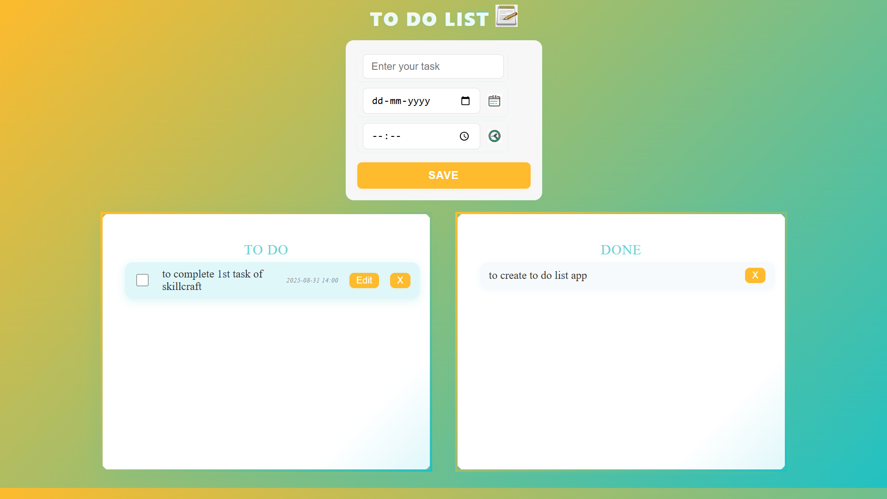

# To Do List App

Responsive To Do List web application built with HTML, CSS, and JavaScript.

## Features

- **Add Tasks:** Enter your task, date, and time, then save it to your list.
- **Edit Tasks:** Update any task directly in the list.
- **Mark as Done:** Check off tasks to move them to the "DONE" section.
- **Delete Tasks:** Remove tasks from either section.
- **Persistent Storage:** Your tasks are saved in your browser (localStorage).
- **Responsive Design:** Works great on desktop and mobile devices.
- **Modern UI:** Gradient backgrounds, icons, and smooth interactions.

## Getting Started

1. **Clone or download** this repository.
2. Make sure the following files are in the same folder:
   - `index.html`
   - `style.css`
   - `index.js`
   - Images: `openbook.png`, `calender.jpg`, `time.jpg`
3. Open `index.html` in your browser.

## File Structure

- `index.html` — Main HTML file for the app interface.
- `style.css` — Styles for layout, colors, and responsiveness.
- `index.js` — Handles task logic, editing, completion, and local storage.
- Images: Used for icons in the UI.

## How to Use

1. **Add a Task:**  
   - Enter your task in the text field.
   - Optionally, select a date and time.
   - Click **SAVE** to add it to your "TO DO" list.

2. **Edit a Task:**  
   - Click **Edit** next to a task to update its text.
   - Click **Save** to confirm changes.

3. **Mark as Done:**  
   - Click the checkbox next to a task to move it to "DONE".

4. **Delete a Task:**  
   - Click the **X** button to remove a task from either list.

5. **Persistent Storage:**  
   - Your tasks are automatically saved and loaded from your browser.

## Responsive Design

- On mobile, the input box and task sections stack vertically for easy access.
- The app adapts to different screen sizes for a smooth experience.

## screenshot  

**Made by sravan_venkata**